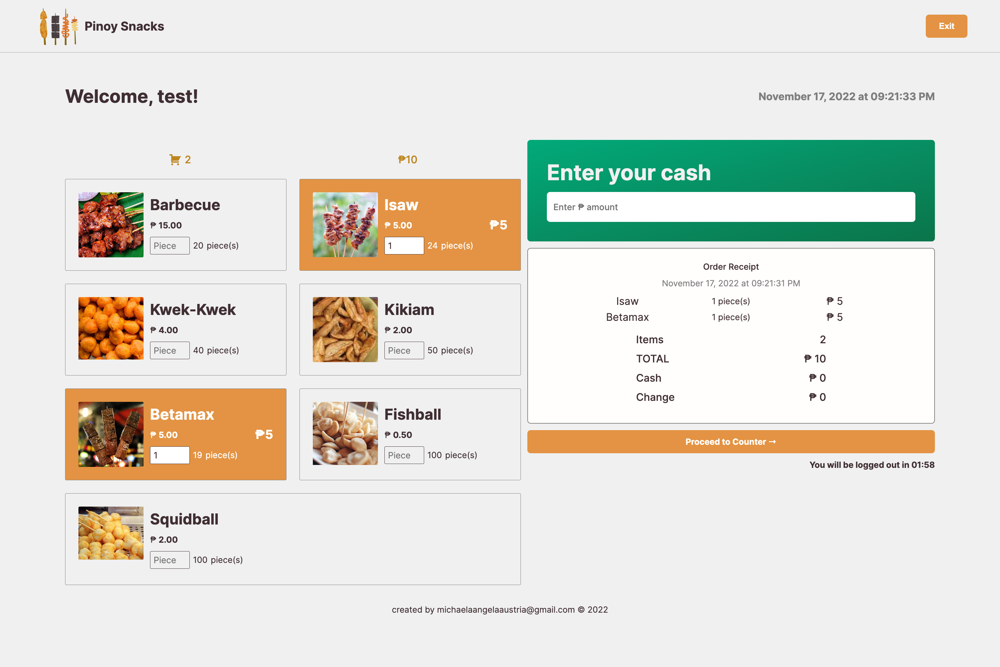

# ⏲ Pinoy Snacks App: Kiosk-like Ordering System

Pinoy Snacks is a kiosk-like ordering system. Customers can tap their food choice, update their order quantity, enter their cash amount, and view their receipt. Everything in the app changes real-time. The app will also logout inactive user.

## Tech Stack
`HTML 5`,  `SASS`, `JavaScript`, `Git`

⚡️ Vanilla JavaScript (VanillaJS) was used to create the functionalities of the app. Arrays were heavely used in this project.

## Features

- Customized checkboxes
- Real-time receipt
- Current Date and Time 
- Session Timeout


## Flowchart


## App Screens

 

## Run Locally
Install dependencies (this will install `sass` and `live-server`)

```bash
  npm install
```

Start the server

```bash
  npm run start
```

Build CSS

```bash
  npm run build:css
```


## License

> Read license [here](LICENSE.txt)

